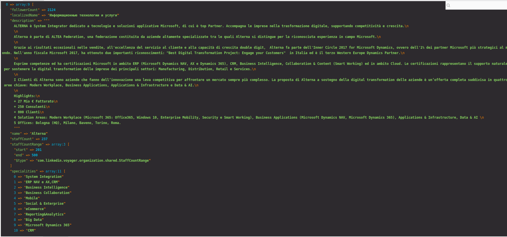

# Install

Step 1
<pre>
 git clone https://github.com/yarmat/linkedin-scraper.git ./
</pre>

Step 2
<pre>
composer install
</pre>

Step 3

Fill login and password from LinkedIn
<pre>
config/linkedin.php
</pre>

Step 4 (Run Script)
```php
php index.php
```

